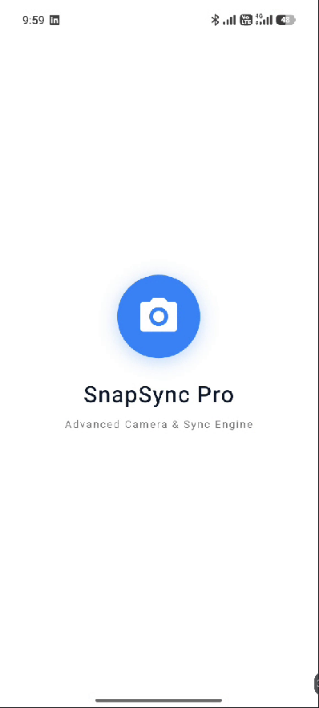
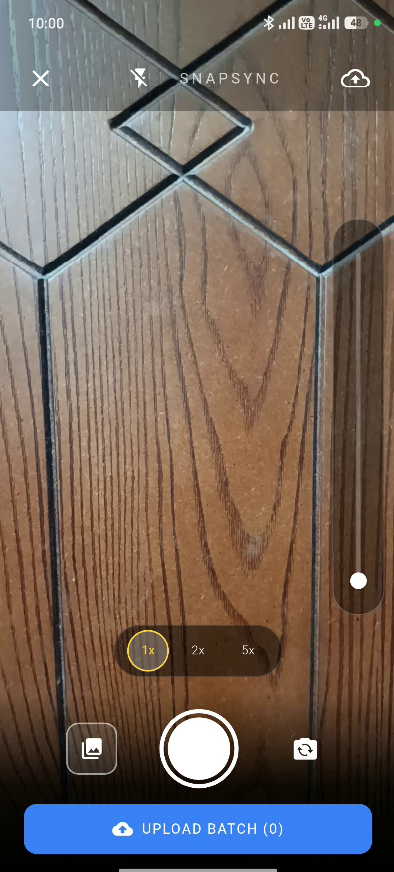
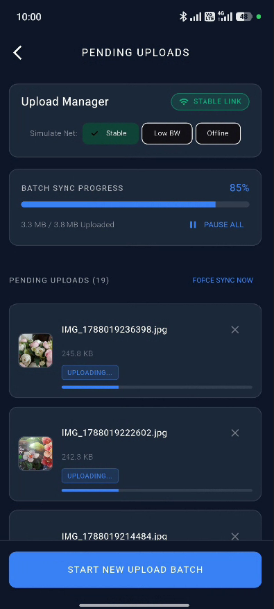

# SnapSync Pro - Advanced Camera & Resilient Sync Engine

**SnapSync Pro** is a high-performance Flutter application built for **Task 2: Advanced Camera & Sync Engine** of the Senior App Developer Technical Assessment. It combines deep hardware integration (custom camera preview, pinch-to-zoom, tap-to-focus) with an offline-first resilient background synchronization engine (local queue persistence, automatic retries on connection restoration, and live status monitoring).

---

## 1. Screenshots & Visual Interface

| Splash Screen | Custom Camera Viewport | Pending Uploads Manager |
|:---:|:---:|:---:|
|  |  |  |

---

## 2. Project Architecture & Approaches

### Architecture Approach
This project follows a **Clean Layered MVVM Architecture** combined with the **BLoC (Business Logic Component)** pattern to ensure strict separation of concerns, high testability, and state predictability. 

### Core BLoC Classes & Responsibilities
- **`CameraBloc`**: Manages hardware camera initialization, pinch-to-zoom calculations, tap-to-focus normalization, flash toggling, and multi-photo batch capturing stack.
- **`SyncBloc`**: Handles local persistent storage queue operations (`Hive`), monitors network connectivity (`connectivity_plus`), streams upload progress, and automatically retries pending/failed uploads upon network restoration.

### Key Architectural Layers
```
lib/
├── core/
│   ├── theme/          # AppTheme dark color palette
│   └── network/        # MockNetworkService with progress streams & failure simulation
├── features/
│   ├── splash/
│   │   └── presentation/screens/splash_screen.dart   # Clean white startup splash screen
│   ├── camera/
│   │   ├── domain/     # CapturedItem models
│   │   └── presentation/
│   │       ├── bloc/   # CameraBloc, CameraEvent, CameraState
│   │       ├── screens/# CameraPreviewScreen
│   │       └── widgets/# FocusRingWidget, ZoomControlsWidget, CameraHeaderWidget
│   └── sync/
│       ├── domain/     # UploadBatch, SyncStatus entities & repository interface
│       ├── data/       # SyncLocalDataSource (Hive DB) & SyncRepositoryImpl
│       └── presentation/
│           ├── bloc/   # SyncBloc, SyncEvent, SyncState
│           ├── screens/# UploadManagerScreen
│           └── widgets/# SyncHeaderStatus, OverallProgressBar, BatchItemCard, ImageViewerDialog
└── main.dart           # Hive initialization, MultiBlocProvider, & App entry point
```

---

## 3. Key Features & Implementation Details

1. **Custom Camera UI (`CameraPreviewScreen`)**:
   - **Pinch-to-Zoom & Zoom Controls**: Hardware-aware pinch scale gestures, vertical zoom slider, and rounded zoom preset pills (`0.5x`, `1x`, `2x`, `5x`) positioned above shutter controls.
   - **Tap-to-Focus**: Interactive viewport tap focusing with animated target ring indicator (`FocusRingWidget`).
   - **Multi-Photo Batching**: Captures multiple images into an active batch with live item count badge on shutter and thumbnail.

2. **Resilient Background Sync Engine (`UploadManagerScreen`)**:
   - **Offline Persistence**: Queues captured images in `Hive` persistent storage so uploads survive app restarts.
   - **Real Image Thumbnails**: Each captured photo is listed with its real image thumbnail preview, size, and timestamp.
   - **Automatic Retry Engine**: Auto-detects network restoration (`connectivity_plus`) and retries pending uploads without manual intervention.
   - **Network Simulation Tools**: Interactive UI chips to switch between `Stable`, `Low BW`, and `Offline` modes.
   - **Full-Screen Image Viewer**: Tapping any item opens an interactive modal ([`ImageViewerDialog`](file:///F:/Inteligence%20Machine%20Task/snapsync_pro/lib/features/sync/presentation/widgets/image_viewer_dialog.dart)) supporting pinch-to-zoom and detailed file metadata.

---

## 4. Generative AI Usage Statement

Generative AI (Antigravity AI Assistant) was used as a pair-programming partner during development for architectural planning, code structuring, and refining UI interactions.

### Essential Prompts Used:
1. **Camera Controls & Hardware Integration Prompt**:
   > *"Help me build a custom Flutter camera preview using `CameraController`. I need smooth pinch-to-zoom with min/max bounds, a vertical zoom slider, preset zoom pills (2x, 3x, 5x), and tap-to-focus with an animated focus ring at the tap position."*

2. **Resilient Offline Sync Engine Prompt**:
   > *"How do I implement an offline-first upload queue using BLoC and Hive? When network drops or an upload fails due to low bandwidth, keep images saved locally and automatically retry the upload once internet connection comes back."*

---

## 5. How to Run

### Prerequisites
- Flutter SDK `^3.38.3` (Dart `^3.10.1`)
- Git installed on your system
- Android Studio / VS Code
- Physical Android Device or Emulator (API Level 23+)

### Setup Steps
1. **Clone the GitHub repository**:
   ```bash
   git clone https://github.com/mhshobuj/SnapSync-Pro.git
   ```

2. **Navigate into the project directory**:
   ```bash
   cd SnapSync-Pro
   ```

3. **Install dependencies**:
   ```bash
   flutter pub get
   ```

4. **Run static code analysis**:
   ```bash
   flutter analyze
   ```

5. **Run the app on a connected device or emulator**:
   ```bash
   flutter run
   ```

6. **Build Release APK**:
   ```bash
   flutter build apk --release
   ``` 
