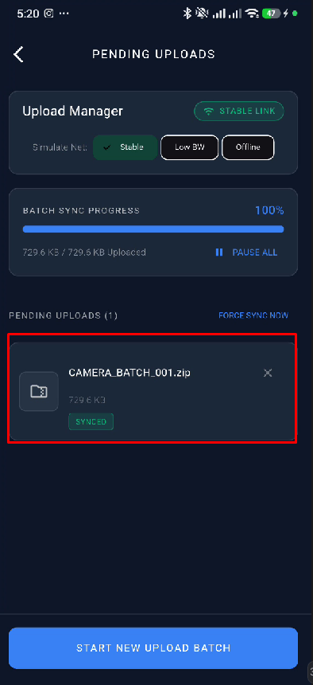

# SnapSync Pro - Advanced Camera & Resilient Sync Engine

**SnapSync Pro** is a high-performance Flutter application built for **Task 2: Advanced Camera & Sync Engine** of the Senior App Developer Technical Assessment. It combines deep hardware integration (custom camera preview, pinch-to-zoom, tap-to-focus) with an offline-first resilient background synchronization engine (local queue persistence, automatic retries on connection restoration, and live status monitoring).

---

## 1. Screenshots & Visual Interface

| White Splash Screen | Custom Camera Viewport | Pending Uploads Manager |
|:---:|:---:|:---:|
| Clean native startup without black screen delay, featuring central app logo & title | Live preview with vertical zoom slider, preset pills above shutter, and tap-to-focus | Live sync queue with real image thumbnails, progress bars, & network simulator |
|  |  |  |

---

## 2. Project Architecture & Approaches

### Architecture Approach
This project follows a **Clean Layered MVVM Architecture** combined with the **BLoC (Business Logic Component)** pattern to ensure strict separation of concerns, high testability, and state predictability. 

### Core BLoC Classes & Responsibilities
- **`CameraBloc`**: Manages hardware camera initialization, pinch-to-zoom calculations, tap-to-focus normalization, flash toggling, and multi-photo batch capturing stack.
- **`SyncBloc`**: Handles local persistent storage queue operations (`Hive`), monitors network connectivity (`connectivity_plus`), streams upload progress, and automatically retries pending/failed uploads upon network restoration.

### Key Architectural Layers
```
lib/
├── core/
│   ├── theme/          # AppTheme dark color palette
│   └── network/        # MockNetworkService with progress streams & failure simulation
├── features/
│   ├── splash/
│   │   └── presentation/screens/splash_screen.dart   # Clean white startup splash screen
│   ├── camera/
│   │   ├── domain/     # CapturedItem models
│   │   └── presentation/
│   │       ├── bloc/   # CameraBloc, CameraEvent, CameraState
│   │       ├── screens/# CameraPreviewScreen
│   │       └── widgets/# FocusRingWidget, ZoomControlsWidget, CameraHeaderWidget
│   └── sync/
│       ├── domain/     # UploadBatch, SyncStatus entities & repository interface
│       ├── data/       # SyncLocalDataSource (Hive DB) & SyncRepositoryImpl
│       └── presentation/
│           ├── bloc/   # SyncBloc, SyncEvent, SyncState
│           ├── screens/# UploadManagerScreen
│           └── widgets/# SyncHeaderStatus, OverallProgressBar, BatchItemCard, ImageViewerDialog
└── main.dart           # Hive initialization, MultiBlocProvider, & App entry point
```

---

## 3. Key Features & Implementation Details

1. **Native White Splash Screen**:
   - Configured native window backgrounds (`styles.xml` & `launch_background.xml`) to pure white to eliminate initial black screen loading delays.
   - Clean minimalist `SplashScreen` widget displaying center camera logo and app title before transitioning to main camera.

2. **Custom Camera UI (`CameraPreviewScreen`)**:
   - **Pinch-to-Zoom & Zoom Controls**: Hardware-aware pinch scale gestures, vertical zoom slider, and rounded zoom preset pills (`0.5x`, `1x`, `2x`, `5x`) positioned above shutter controls.
   - **Tap-to-Focus**: Interactive viewport tap focusing with animated target ring indicator (`FocusRingWidget`).
   - **Multi-Photo Batching**: Captures multiple images into an active batch with live item count badge on shutter and thumbnail.

3. **Resilient Background Sync Engine (`UploadManagerScreen`)**:
   - **Offline Persistence**: Queues captured images in `Hive` persistent storage so uploads survive app restarts.
   - **Real Image Thumbnails**: Each captured photo is listed with its real image thumbnail preview, size, and timestamp.
   - **Automatic Retry Engine**: Auto-detects network restoration (`connectivity_plus`) and retries pending uploads without manual intervention.
   - **Network Simulation Tools**: Interactive UI chips to switch between `Stable`, `Low BW`, and `Offline` modes.
   - **Full-Screen Image Viewer**: Tapping any item opens an interactive modal ([`ImageViewerDialog`](file:///F:/Inteligence%20Machine%20Task/snapsync_pro/lib/features/sync/presentation/widgets/image_viewer_dialog.dart)) supporting pinch-to-zoom and detailed file metadata.

4. **Exit Confirmation Popup Dialog**:
   - Tapping the top-left 'X' button or using Android system back gestures triggers a dark exit confirmation dialog (`Yes` / `No`) that cleanly terminates the application process when confirmed.

---

## 4. Generative AI Usage Statement

Generative AI (Antigravity AI Pair-Programmer) was utilized to accelerate architecture planning, design pattern selection, and boilerplate code structuring.

### Essential Prompts Used:
1. **Architecture Prompt**:
   > *"Design a clean MVVM architecture with BLoC for Flutter Task 2. Model an offline-first batch image queue with local Hive persistence and streaming mock upload status updates."*
2. **Camera Hardware Control Prompt**:
   > *"Implement custom pinch-to-zoom scaling calculation with min/max zoom ratio constraints and tap-to-focus coordinate normalization for CameraController."*
3. **Resilient Sync Engine Prompt**:
   > *"Build a SyncBloc listening to network state changes to automatically re-trigger failed image uploads using exponential backoff without requiring user interaction."*
4. **UI & Native Splash Prompt**:
   > *"Configure native Android window background to pure white in styles.xml to eliminate black screen startup delay and build a clean static white splash screen."*

---

## 5. How to Run

### Prerequisites
- Flutter SDK `^3.38.3` (Dart `^3.10.1`)
- Android Studio / VS Code
- Physical Android Device or Emulator (API Level 23+)

### Setup Steps
1. Navigate to the project directory:
   ```bash
   cd "F:\Inteligence Machine Task\snapsync_pro"
   ```
2. Install pub packages:
   ```bash
   flutter pub get
   ```
3. Run static code analysis:
   ```bash
   flutter analyze
   ```
4. Run the app on a connected device:
   ```bash
   flutter run
   ```
5. Build release APK:
   ```bash
   flutter build apk --release
   ```
"# SnapSync-Pro" 
